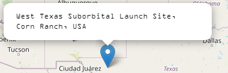
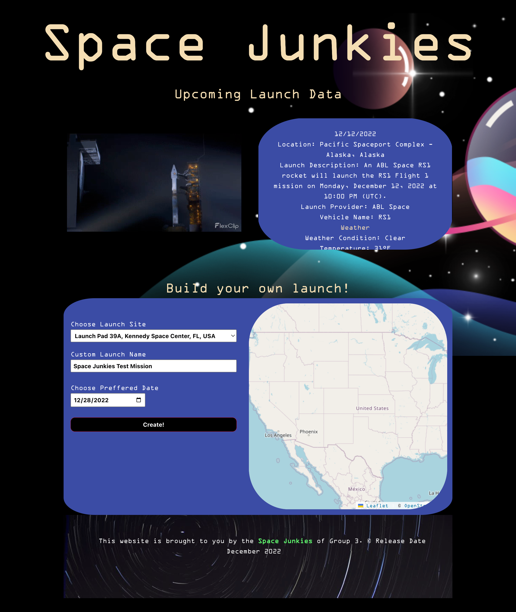

# Space Junkies
## Site Description
Within this project, our goal was to set up a informational space themed webpage that allows the user to build their own launch.

## Deployed Site
https://tmortara.github.io/Space-Junkies/

## Navigating the Space Junkies Site
To do this we used two separate pages. The top of the first page displays the next 5 launches, built from the Rocket Launch Live API, and the weather forecast for each launch. 

The second section includes a map, built from the Leaflet API, that displays the 10 launch locations in North America.

The map allows the user to find the closest launch site to their current location.  Once the user finds their desired location, they can select the location from the dropdown.  

Next the user can create a custom name for their launch and select a launch date. 

Clicking the create button will show the Modal that provides a Warning message to the User before procedding to the launch results page.

The launch results page allows the user to view the results of their launch and the 5 day forecast for their selected launch location.

## Web Api's
We shot above and beyond the stars and decided to use 3 APIs to help our webpage function and provide the user with all the information they need to build their launch.

1. [Rocket Launch Live](https://www.rocketlaunch.live/api#Launches)

The Rocket Launch Live API response provides the user with information for the next 5 rocket launches and the forecasted weather for each launch.

2. [Leaflet](https://leafletjs.com/index.html)

The Leaflet API allows the user to interact and see the positions of launch pad locations in Amercia. 

3. [OpenWeather: 5 Day Forecast](https://openweathermap.org/forecast5)

The OpenWeather 5 Day Forecast API displays the upcoming forecast for the launch.  A message is displayed below the forecast in case the user selects a date outside of the 5 Day Forecast window.

## Local Storage
The selected location, custom launch name, and date of launch inputs from the user are stored in local storage upon clicking submit.  

It stores this data and allows the Space Junkies team to render the data to the launch results page.

## Modal
We used the modal on our webpage as a fun transition between the two pages. It acts as a warning message to not actually launch a rocket at the different launch pads.

## Technologies Used
- HTML
- CSS
- JavaScript
- APIs:
    - [Rocket Launch Live](https://www.rocketlaunch.live/api#Launches)
    - [Leaflet](https://leafletjs.com/index.html)
    - [OpenWeather: 5 Day Forecast](https://openweathermap.org/forecast5)
- [Bulma](https://bulma.io/)

## Installation
None

## License
MIT license

## Screenshots of Site

Launch Results

